## 前言

前几天，红帽官方宣布CentOS 8于2021年年底结束维护。CentOS 已死！＂免费＂的 RHEL 没了...

所以，博主选择了Ubuntu Server版本。

在本教程中，我们将引导您逐步安装 Ubuntu 服务器 24.04 LTS。
此教程也适用于Ubunut Server 22.04 LTS


本文所需的文件已经提供至博主的网盘：[拾柒的小网盘](https://pan.jianglin.cc:8443)

## 正文

### 一、准备工作

#### 1. 下载镜像

去Ubuntu官网找到Ubuntu Server的镜像文件（[Ubuntu官网](https://ubuntu.com/download/server)），按照自己的需求下载 iso文件
历史镜像地址：[Ubuntu-releases](https://releases.ubuntu.com/)
#### 2. 制作启动盘

- 用Rufus制作启动盘，到官网下载文件（[rufus官网](https://rufus.ie/zh/) ）或者使用 [Etcher}(https://etcher.balena.io/)
- 分区类型：选择GPT，目标系统类型UEFI（非SM）

**随后重启系统，启动至U盘内的安装程序**

### 二、系统安装

**进入到安装界面，选择** Try orInstall Ubuntu Server -> 回车

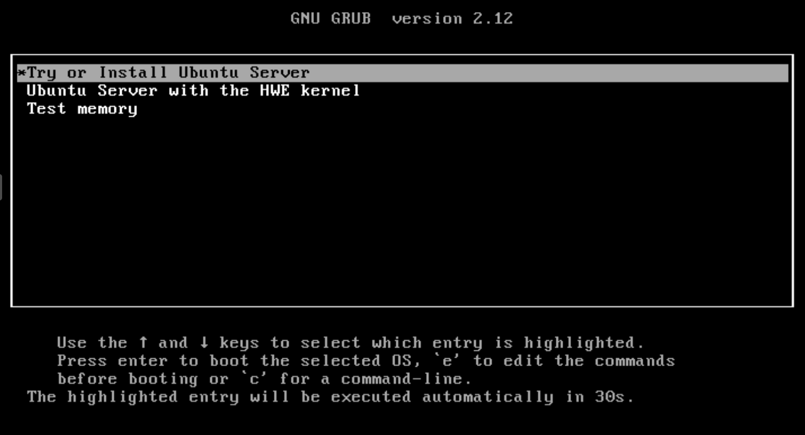

##### 1. 语言选择

**等待进入语言选择界面，因为没有中文，所以直接选择English 回车进入**

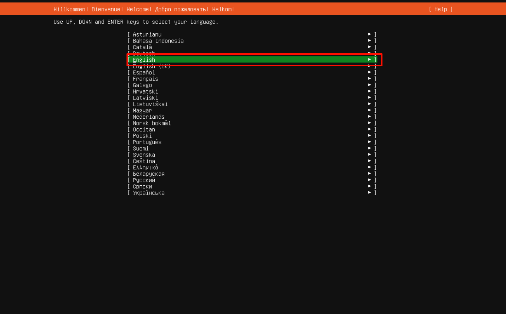

**进入键盘配置界面，回车进入**

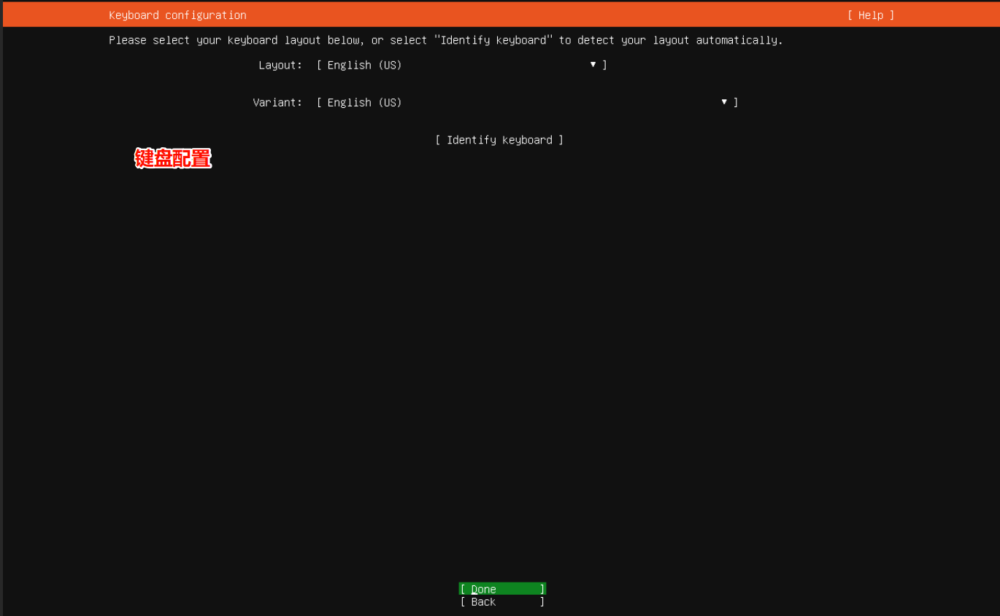

##### 2. **选择安装类型**

- 完整安装：默认安装包含一组精心策划的软件包，为操作您的服务器提供舒适的体验
- 最小化安装：本已被定制为在人类不期望登录的环境中具有较小的运行时足迹。

这里推荐使用完整安装，因为最小化安装的组件是不全的。

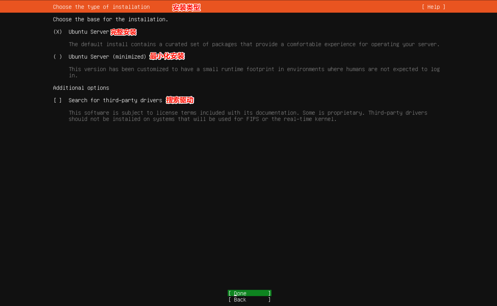

##### 3. **配置网络**

按tab键选中**DHCPv4地址**，选择 **Edit IPV4**，回车进入

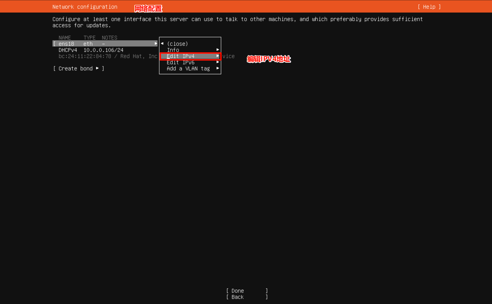

进行静态IP配置

解释下是什么意思：

**Automatic**：DHCP模式，由路由器分配IP地址，但是地址可能会随着重启变化

**Manual**：静态IP模式

- **Subnet**：为子网IP，通常为xxx.xxx.xxx.0/24
- **Address**：为IP地址，通常为xxx.xxx.xxx.xxx，填写局域网内不冲突的ip地址
- **Gateway**：网关IP地址，通常为xxx.xxx.xxx.1
- **Name servers**：DNS地址

填写完成之后，按**Tab**键，选择 **Save** 回车，看到地址更改后，选择**Done** 进入下一界面

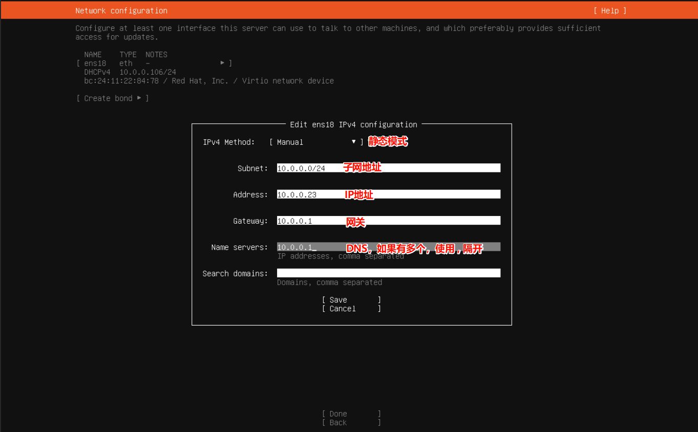

**配置代理地址**

通常情况下不需要配置

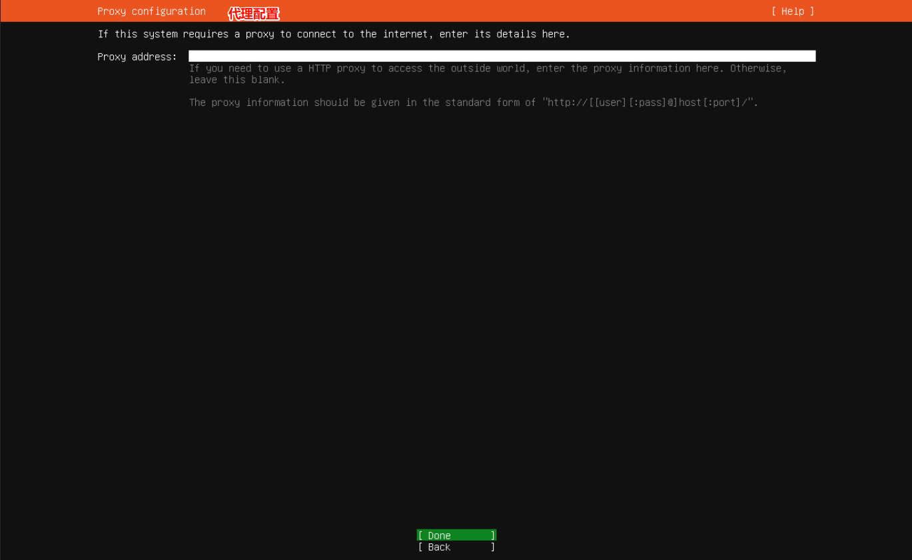

##### 4. 配置镜像源

默认是官方镜像源，推荐使用清华大学镜像源

```yaml
# 清华大学镜像源
http://mirrors.tuna.tsinghua.edu.cn/ubuntu
```

填完之后回车进行验证

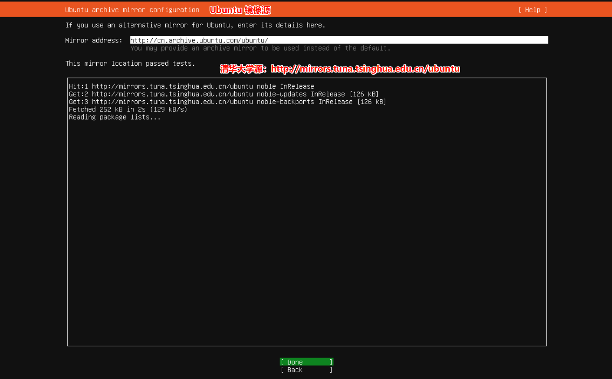

**配置硬盘**

一般不需要配置，直接回车下一步就可以了

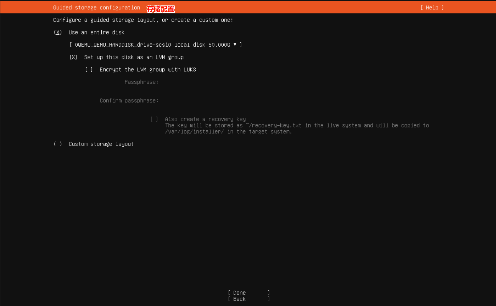

一路回车，随后选择**Continue**

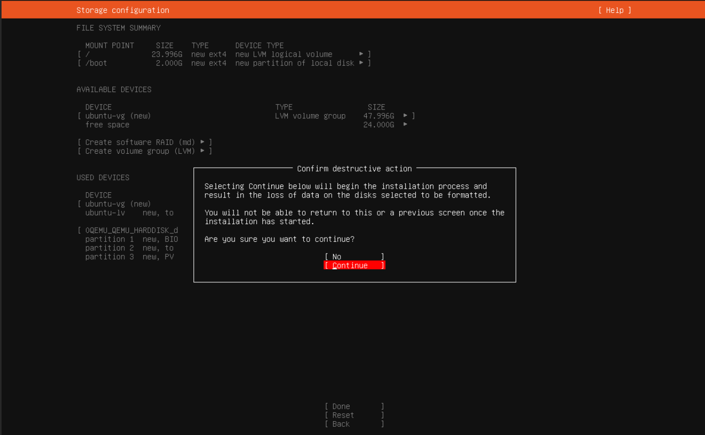

**配置用户信息**

- Your name：用户名
- Your servers name：服务器名称
- Pick a username：登录名
- Choose a password：密码
- Confirm your password：密码

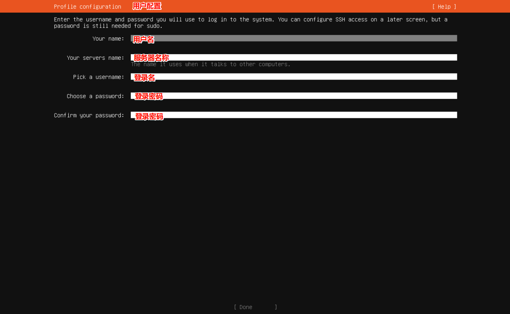

**更新到最新版本**

一般不需要，直接回车就行

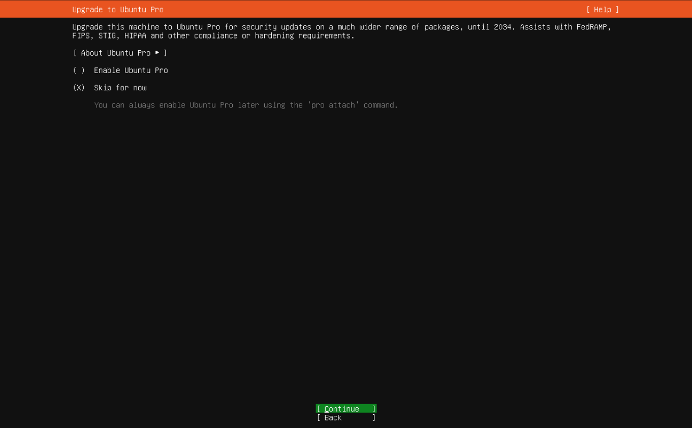

##### 5. SSH配置

选中 **Install OpenSSH server** 按空格，选中 随后选择Done 回车

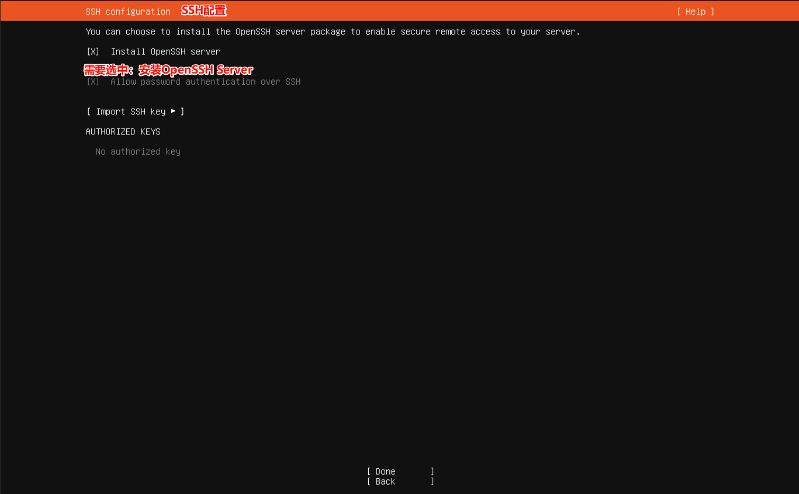


##### 6. 其他配置

不需要选择，如果需要安装，可进入系统内再进行安装

回车之后就直接开始安装了

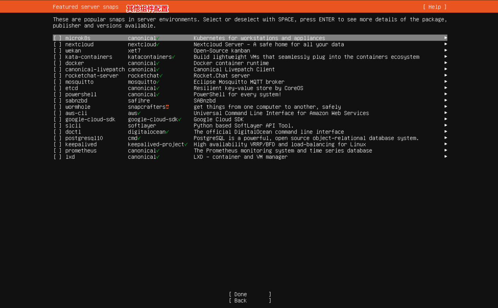

##### 7. 安装完成

安装完成后，选择 **Reboot Now**回车重启

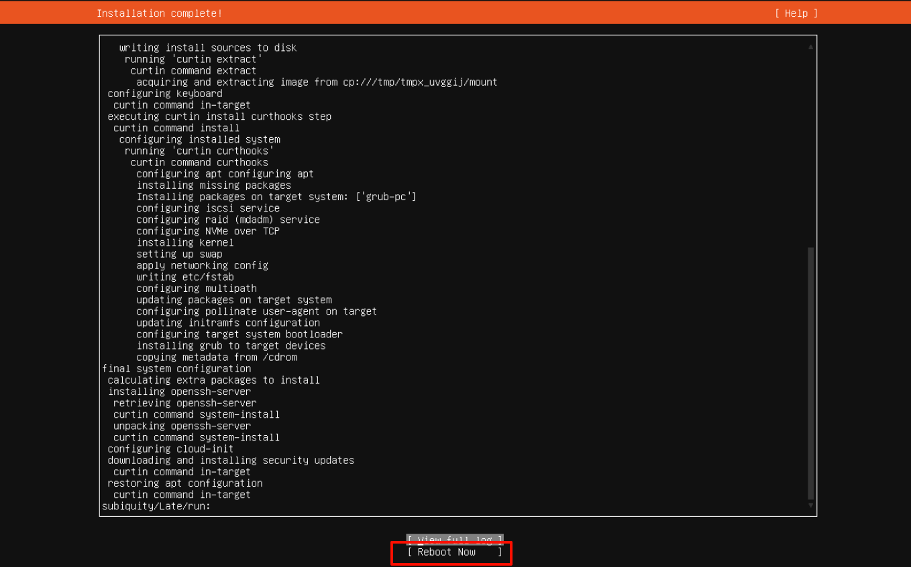

根据提示，拔出安装介质，回车重启。


#### 8. 查看发行版本
```shell
lsb_release -a

# ------------------------
root@vm11:/home/jianglin# lsb_release -a
No LSB modules are available.
Distributor ID: Ubuntu
Description:    Ubuntu 24.04.3 LTS
Release:        24.04
Codename:       noble

```
### 三、系统配置

#### 1. root账户设置密码

```shell
# 通过普通账户登录

# 切换至root用户
sudo su
# 修改root密码
passwd
```

#### 2. ssh配置

```shell
# 查看是否安装了SSH服务
ps -ef |grep ssh 

# 没有安装的话，执行下面语句
sudo apt-get update                   #先更新下资源列表
sudo apt-get install openssh-server   #安装openssh-server
sudo ps -ef | grep ssh                #查看是否安装成功
sudo systemctl restart sshd           #重新启动SSH服务 

# 进入ssh配置文件
sudo vim  /etc/ssh/sshd_config    
```

**修改Root远程登录权限**

按i进入编辑模式，找到`#PermitRootLogin prohibit-password`，默认是注释掉的。
把 `PermitRootLogin without-password` 改为 `PermitRootLogin yes`，注意`PermitRootLogin without-password`被注释掉了，要去掉注释。如果没有找到`PermitRootLogin without-password`，直接文件末尾添加`PermitRootLogin yes`即可。然后按esc，输入:wq保存并退出。
重启sshd服务

```shell
# 重启ssh服务
sudo systemctl daemon-reload
sudo systemctl restart ssh

# 如果连接不上，禁用防火墙
systemctl stop ufw
```


> `PermitRootLogin` 是一个用于配置 SSH 服务器的选项。这个选项决定了是否允许 root 用户通过 SSH 直接登录到服务器。通常情况下，为了提高安全性，最好禁止 root 用户通过 SSH 直接登录，而是使用一个普通用户登录后再通过 su 或者 sudo 切换到 root 用户来执行需要特权的操作。这样可以降低系统受到攻击的风险。
> 常见的 PermitRootLogin 选项取值包括：
>
> - `yes`：允许 root 用户通过 SSH 直接登录。
> - `no`：禁止 root 用户通过 SSH 直接登录。
> - `without-password`：允许 root 用户通过 SSH 密钥登录，但不允许使用密码登录。

#### 3. 网络配置

1. 打开终端，使用root权限登录或者使用sudo命令获取root权限。

2. 使用文本编辑器打开网络配置文件`/etc/netplan/00-installer-config.yaml`。

   ```bash
   sudo vim /etc/netplan/50-cloud-init.yaml
   ```

3. 在文件中，找到`network`部分，然后根据你的网络设置进行编辑。以下是一个示例配置：

   ```yaml
   network:
     ethernets:
       enp0s3:
         addresses: [192.168.1.10/24]
         gateway4: 192.168.1.1
         nameservers:
           addresses: [8.8.8.8, 8.8.4.4]
     version: 2
   ```

    - `enp0s3`是网络接口的名称，你需要根据你的实际网络接口名称进行替换。
    - `addresses`是你的服务器的静态IP地址和子网掩码。
    - `gateway4`是你的网关IP地址。
    - `nameservers`是DNS服务器的IP地址。


4. 保存文件并关闭文本编辑器。

5. 在终端中执行以下命令以应用配置更改：

   ```bash
   sudo netplan apply
   ```

6. 重新启动网络服务以使更改生效：

   ```bash
   sudo systemctl restart networking
   ```

现在，你的Ubuntu已经配置了静态网络。你可以通过ping命令或打开浏览器测试网络连接。
7. 禁用自动配置
在22.04中，会使用自动配置，使用下面的代码取消自动配置。
```shell
sudo tee /etc/cloud/cloud.cfg.d/99-disable-network-config.cfg << 'EOF'
network: {config: disabled}
EOF
```
8. 禁用ipv6
```shell
# 修改grub
vim /etc/default/grub

# 找到以下行，添加ipv6.disable=1
GRUB_CMDLINE_LINUX_DEFAULT="ipv6.disable=1"

# 更新GRUB
sudo update-grub
```
#### 4. 扩容硬盘

登录进系统，执行**lsblk**查看分区配置

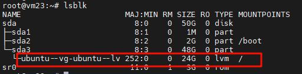

可以看到 **/** 目录下才24G，但是上级却有48G，严重不对，现在要进行扩容

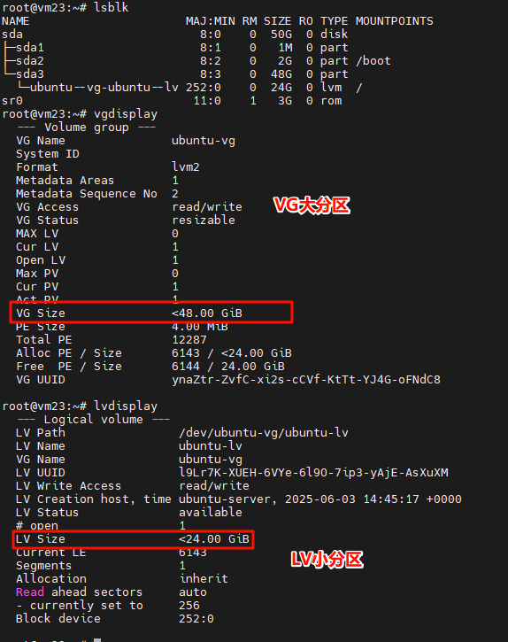

1. 使用 `lvextend` 命令扩展逻辑卷：

```shell
sudo lvextend -l +100%FREE /dev/ubuntu-vg/ubuntu-lv
```

2. 扩展文件系统以使用新增加的空间（假设文件系统是 ext4 或 xfs）：

```bash
# 对于 ext4 文件系统：
sudo resize2fs /dev/ubuntu-vg/ubuntu-lv

# 对于 XFS 文件系统：
sudo xfs_growfs /
```

#### 5. apt换源

参考配置 [清华大学开源软件镜像站](https://mirrors.tuna.tsinghua.edu.cn/help/ubuntu/)

```yaml
mv /etc/apt/sources.list.d/ubuntu.sources /etc/apt/sources.list.d/ubuntu.sources.backup
vim /etc/apt/sources.list.d/ubuntu.sources


# 24.02源
Types: deb
URIs: https://mirrors.tuna.tsinghua.edu.cn/ubuntu
Suites: noble noble-updates noble-backports
Components: main restricted universe multiverse
Signed-By: /usr/share/keyrings/ubuntu-archive-keyring.gpg

# 默认注释了源码镜像以提高 apt update 速度，如有需要可自行取消注释
# Types: deb-src
# URIs: https://mirrors.tuna.tsinghua.edu.cn/ubuntu
# Suites: noble noble-updates noble-backports
# Components: main restricted universe multiverse
# Signed-By: /usr/share/keyrings/ubuntu-archive-keyring.gpg

# 以下安全更新软件源包含了官方源与镜像站配置，如有需要可自行修改注释切换
Types: deb
URIs: https://mirrors.tuna.tsinghua.edu.cn/ubuntu
Suites: noble-security
Components: main restricted universe multiverse
Signed-By: /usr/share/keyrings/ubuntu-archive-keyring.gpg

# Types: deb-src
# URIs: https://mirrors.tuna.tsinghua.edu.cn/ubuntu
# Suites: noble-security
# Components: main restricted universe multiverse
# Signed-By: /usr/share/keyrings/ubuntu-archive-keyring.gpg

# 预发布软件源，不建议启用

# Types: deb
# URIs: https://mirrors.tuna.tsinghua.edu.cn/ubuntu
# Suites: noble-proposed
# Components: main restricted universe multiverse
# Signed-By: /usr/share/keyrings/ubuntu-archive-keyring.gpg

# # Types: deb-src
# # URIs: https://mirrors.tuna.tsinghua.edu.cn/ubuntu
# # Suites: noble-proposed
# # Components: main restricted universe multiverse
# # Signed-By: /usr/share/keyrings/ubuntu-archive-keyring.gpg
```

```shell

mv /etc/apt/sources.list /etc/apt/sources.list.backup

vim /etc/apt/sources.list


# 22.04源
# 默认注释了源码镜像以提高 apt update 速度，如有需要可自行取消注释
deb https://mirrors.tuna.tsinghua.edu.cn/ubuntu/ jammy main restricted universe multiverse 
# deb-src https://mirrors.tuna.tsinghua.edu.cn/ubuntu/ jammy main restricted universe multiverse 
deb https://mirrors.tuna.tsinghua.edu.cn/ubuntu/ jammy-updates main restricted universe multiverse 
# deb-src https://mirrors.tuna.tsinghua.edu.cn/ubuntu/ jammy-updates main restricted universe multiverse 
deb https://mirrors.tuna.tsinghua.edu.cn/ubuntu/ jammy-backports main restricted universe multiverse 
# deb-src https://mirrors.tuna.tsinghua.edu.cn/ubuntu/ jammy-backports main restricted universe multiverse 
deb https://mirrors.tuna.tsinghua.edu.cn/ubuntu/ jammy-security main restricted universe multiverse 
# deb-src https://mirrors.tuna.tsinghua.edu.cn/ubuntu/ jammy-security main restricted universe multiverse 

# 预发布软件源，不建议启用 
# deb https://mirrors.tuna.tsinghua.edu.cn/ubuntu/ jammy-proposed main restricted universe multiverse 
# deb-src https://mirrors.tuna.tsinghua.edu.cn/ubuntu/ jammy-proposed main restricted universe multiverse
```


**复制后更新源**


```bash
sudo apt update -y
sudo apt upgrade -y
```

更新后，推荐重启一下系统


#### 6. 防止未来自动升级

```shell
sudo nano /etc/update-manager/release-upgrades
# 改为
Prompt=never
```

#### 7. 其他
##### 安装组件
```shell
apt install -y zip unzip htop tree

zip unzip # zip解压工具
htop # 资源监控工具
tree # 文件目录查看工具


```
##### nfs挂载

```bash
# 安装nfs
sudo apt install nfs-common
# 创建挂载目录
mkdir /mnt/appdata

# 测试挂载
mount 10.0.0.10:/mnt/SSD-Storage/appdata/vm-docker /mnt/appdata
# 取消挂载
umount /mnt/appdata

# 开机自动挂载目录
vim /etc/fstab
# 添加以下内容
10.0.0.10:/mnt/SSD-Storage/appdata/vm-docker /mnt/appdata nfs defaults 0 0
```
