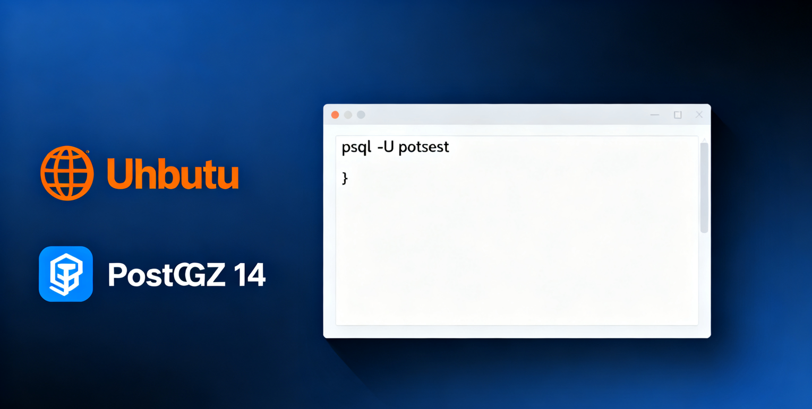

PostgreSQL 标榜自己是世界上最先进的开源数据库，属于关系型数据库管理系统 (ORDBMS)， 是以加州大学计算机系开发的 POSTGRES，4.2 版本为基础的对象关系型数据库管理系统， 最初是 1985 年在加利福尼亚大学伯克利分校开发的，作为 Ingres 数据库的后继。

相对于 Postgres MySQL 更简单， 所以有着更高的流行度， 在技术资料，以及技术组件支持上，支持的也更完善一些， 但不意味着它并不是不能替代的， 于笔者而言， MYSQL 更像用于中小企业、个人的一款数据库工具， 因为会的人多， 文档资料比较完善，所以入手难度低。但这些并不意味着 MYSQL 是最好的。

MySQL 适用的场景 MySQL 适用于简单的应用场景，如电子商务、博客、网站等, 大中小型系统均可以使用 MySQL， 它最高支持千万级别到数亿级别的数据量， 但是在高性能要求的情况下， 比如较快的响应和较高的吞吐量的时候， MySQL 的性能稍微捉襟见肘， 另外，在查询条件比较复杂、业务吞吐量要求不高，响应时长无要求，的时候，可以选择 MySQL，

Postgres SQL适用的场景 总的来说， Postgre SQL 更适合复杂的数据结构、高级应用和大规模数据集， 当然如果数据规模比较小， 也可以选择 Postgres SQL， 无论是什么场景，如果你想用 Postgres SQL， 总可以找到对应的解决方法, 有且仅有， 在查询条件比较复杂，的时候不太适用， 因为根据我们实际线上的业务表现是 Postgre SQL 可能会选错索引。

## 常规安装
### 查询安装包
```shell
apt -search postgresql-14
```
### 安装postgresql-14
```shell
apt install postgresql-14
```
>安装成功后， 会自动创建一个数据库用户 postgres

### 修改数据库存储位置(可选)
#### 停止PostgreSQL
```shell
systemctl stop postgresql
```
#### 拷贝原来的数据路径到新的路径下
```shell
cp -rf /var/lib/postgresql/14/main /app/postgresql/
```
#### 设置用户和权限
```shell
chown -R postgres:postgres /app/postgresql/
chmod 700 /app/postgresql/
```

#### 将配置文件的数据存储路径改成新的
```shell
vim /etc/postgresql/14/main/postgresql.conf
data_directory='/app/postgresql/'
```
#### 再启动即可
```shell
systemctl start postgresql
```
#### 查看当前数据目录

```shell
psql -U postgres

postgres=# show data_directory;
       data_directory
-----------------------------
 /var/lib/postgresql/14/main
(1 row)
```

### 修改数据库密码
```shell
# 登录postgres用户
su - postgres
# 登录到数据库中
psql

# 或者直接以root用户登录
psql -U postgres

# 修改密码
alter user postgres with password 'xxxxxx';
```

### 配置远程访问
PostgreSQL 通过一个名为**角色**的概念支持多种客户端身份验证方法。默认的身份验证方法是**身份验证**，它将 Postgres 角色与 Unix 系统帐户关联起来。所有受支持的身份验证方法有：
- **Ident** – 仅支持通过 TCP/IP 连接。它通过可选的用户名映射获取客户端系统用户名。
- **密码** – 角色使用密码进行连接。
- **Peer** – 与 ident 类似，但仅支持本地连接。
- **信任** – 只要满足 ***pg_hba.conf*** 中定义的条件，就允许角色进行连接。
为了远程访问我们的数据库服务器实例，我们应该在文件 **/etc/postgresql/14/main/pg_hba.conf** 中进行更改。
通过运行以下命令允许在 PostgreSQL 服务器上进行密码身份验证。
```shell
sudo sed -i '/^host/s/ident/md5/' /etc/postgresql/14/main/pg_hba.conf
```
接下来是将识别方法从对等更改为**信任**，如下所示。
```shell
sudo sed -i '/^local/s/peer/trust/' /etc/postgresql/14/main/pg_hba.conf
```
要允许从任何地方访问实例，请编辑命令如下：
```shell
sudo vim /etc/postgresql/14/main/pg_hba.conf
```
在该文件中，添加以下行。
```shell
# IPv4 local connections:
host    all             all             0.0.0.0/0                md5
```
现在，通过如下编辑 **/etc/postgresql/14/main/postgresql.conf** 中的 conf 文件来确保服务正在侦听 *。
```shell
sudo vim /etc/postgresql/14/main/postgresql.conf
```
在文件中，取消注释并编辑该行，如下所示。
```shell
#------------------------------------------------------------------------------
# CONNECTIONS AND AUTHENTICATION
#-----------------------------------------------------------------------------
.......
listen_addresses='*'
```
现在重新启动并启用 PostgreSQL 以使更改生效。
```undefined
sudo systemctl restart postgresql
sudo systemctl enable postgresql
```


# PostgreSQL FDW 简单使用教程

## 1. 基础三步法

### 第一步：安装扩展
```sql
-- 在本地数据库执行
CREATE EXTENSION IF NOT EXISTS postgres_fdw;
```

### 第二步：创建远程服务器连接
```sql
-- 创建服务器配置
CREATE SERVER remote_server
    FOREIGN DATA WRAPPER postgres_fdw
    OPTIONS (
        host '172.172.254.200',  -- 远程IP
        dbname 'hf_cy',          -- 远程数据库名
        port '6432'              -- 远程端口
    );
```

### 第三步：创建用户映射
```sql
-- 设置认证信息
CREATE USER MAPPING FOR postgres
    SERVER remote_server
    OPTIONS (
        user 'postgres',              -- 远程数据库用户名
        password 'huanfaCypatroni'    -- 远程数据库密码
    );
```

## 2. 导入远程表（三种方式）

### 方式1：导入单个表
```sql
-- 导入指定表到本地public schema
IMPORT FOREIGN SCHEMA public
LIMIT TO (hf_cy_approval_role)  -- 只导入这个表
FROM SERVER remote_server
INTO public;
```

### 方式2：导入多个表
```sql
-- 导入多个表
IMPORT FOREIGN SCHEMA public
LIMIT TO (table1, table2, table3)  -- 逗号分隔表名
FROM SERVER remote_server
INTO public;
```

### 方式3：导入整个schema（慎用）
```sql
-- 导入整个public schema的所有表
IMPORT FOREIGN SCHEMA public
FROM SERVER remote_server
INTO public;
```

## 3. 使用导入的表

### 基本查询
```sql
-- 像普通表一样查询
SELECT * FROM hf_cy_approval_role LIMIT 10;

-- 带条件查询
SELECT * FROM hf_cy_approval_role WHERE status = 'active';

-- 聚合查询
SELECT COUNT(*) FROM hf_cy_approval_role;
```

### JOIN查询
```sql
-- 本地表和远程表JOIN
SELECT l.*, r.name 
FROM local_table l
JOIN hf_cy_approval_role r ON l.id = r.foreign_id;
```

## 4. 常用管理命令

### 查看配置
```sql
-- 查看所有外部服务器
SELECT * FROM pg_foreign_server;

-- 查看导入的外部表
SELECT * FROM information_schema.foreign_tables;

-- 查看表结构
\d hf_cy_approval_role;
```

### 修改配置
```sql
-- 修改服务器选项
ALTER SERVER remote_server OPTIONS (
    ADD fetch_size '50000'  -- 增加每次获取的行数
);

-- 修改密码
ALTER USER MAPPING FOR postgres
SERVER remote_server
OPTIONS (
    SET password 'new_password'
);
```

### 删除配置
```sql
-- 删除单个外部表
DROP FOREIGN TABLE hf_cy_approval_role;

-- 删除用户映射
DROP USER MAPPING FOR postgres SERVER remote_server;

-- 删除服务器
DROP SERVER remote_server CASCADE;

-- 删除扩展
DROP EXTENSION postgres_fdw;
```

## 5. 快速示例（完整流程）

```sql
-- 完整使用流程示例：

-- 1. 安装
CREATE EXTENSION postgres_fdw;

-- 2. 创建服务器
CREATE SERVER my_remote 
    FOREIGN DATA WRAPPER postgres_fdw
    OPTIONS (host '192.168.1.100', dbname 'mydb', port '5432');

-- 3. 创建用户映射
CREATE USER MAPPING FOR postgres
    SERVER my_remote
    OPTIONS (user 'postgres', password '123456');

-- 4. 导入表
IMPORT FOREIGN SCHEMA public
LIMIT TO (users, orders)
FROM SERVER my_remote
INTO public;

-- 5. 使用表
SELECT * FROM users WHERE id = 1;
SELECT * FROM orders WHERE user_id = 1;
```

## 6. 简单问题排查

### 连接失败
```sql
-- 检查网络连通性（在系统命令行执行）
ping 172.172.254.200
telnet 172.172.254.200 6432

-- 检查远程数据库用户权限
-- 需要在远程数据库确认用户postgres有访问权限
```

### 表不存在
```sql
-- 确认远程表名是否正确
-- 在远程数据库执行：
SELECT schemaname, tablename FROM pg_tables WHERE tablename LIKE '%approval%';
```

### 权限错误
```sql
-- 重新设置密码
ALTER USER MAPPING FOR postgres
SERVER remote_server
OPTIONS (
    SET password 'correct_password'
);
```

## 7. 一句话总结

**安装扩展 → 创建服务器 → 用户映射 → 导入表 → 直接查询**

就这么简单！