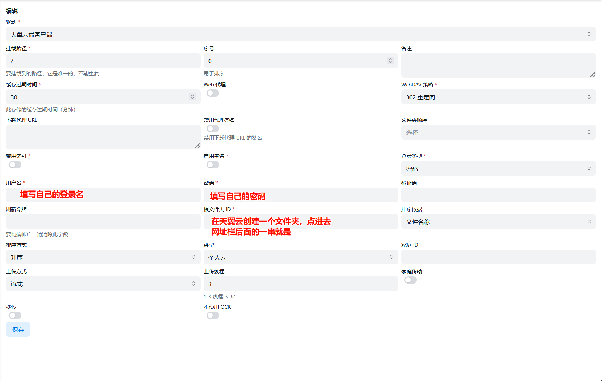
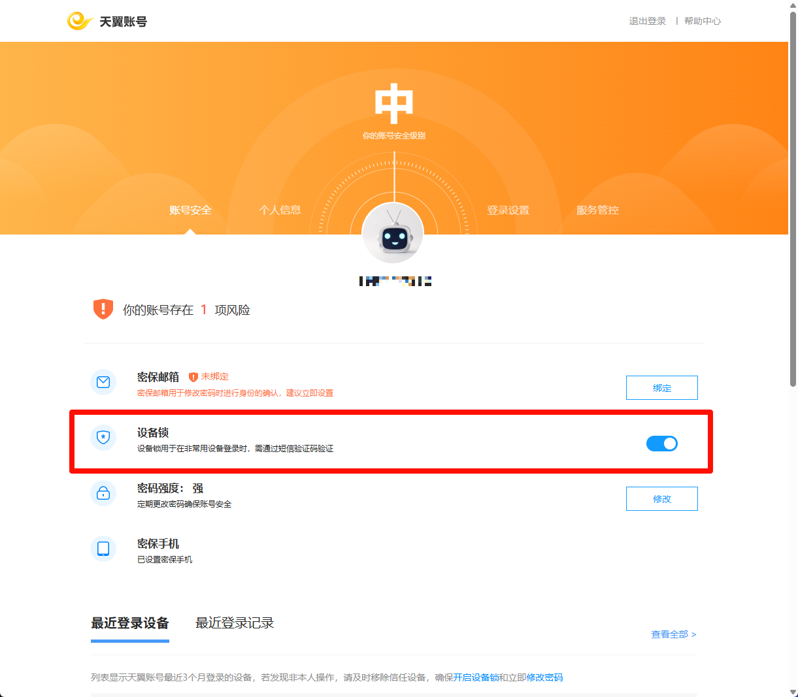

OpenList 是一个支持多种存储的文件列表程序🗂️，是一个有韧性、长期治理、社区驱动的 AList 分支🔀，旨在防御基于信任的开源攻击🛡️。

配置文档：[OpenList - Doc](https://doc.oplist.org/)

## Docker部署

下面使用DockerCompose部署OpenList
```yaml

services:
  openlist:
    image: 'openlistteam/openlist:latest'
    container_name: openlist
    volumes:
      - './data:/opt/openlist/data'
	user: '0:0'
    ports:
      - '5244:5244'
    environment:
      - UMASK=022
    restart: always  
    networks:
      - app-net
networks:
  app-net:
    external: true

```

## 挂载存储

### 挂载天翼云盘客户端
如果有电信卡的朋友可以尝试下不限速的网盘：天翼云
挂载教程：[电信天翼云盘](https://doc.oplist.org/guide/drivers/189#%E4%B8%AA%E4%BA%BA%E4%BA%91)

添加存储按照如图填写


如果报错
>Failed init storage: login failed,No toUrl obtained, msg: 设备ID不存在，需要二次设备校验

需要关闭天翼账号的设备锁
登录天翼账号：https://e.dlife.cn/portal/web/index.html#/login
随后关闭设备锁


其他绑定方式见官网文档：[OpenList 添加存储](https://doc.oplist.org/guide/drivers/common)
